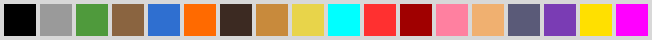

# Levels

A level is a folder `levels/<name>/` (loaded by `sim/level.gd`):

| File | |
|---|---|
| `layout.png` | the map, one colour per pixel from the legend below |
| `height.png` | optional: how high each cell stands, in grey |
| `level.json` | its name, legend overrides, the entities' names and props, the start order, spawn points, level links |

Every level is a zone on the server (docs/design.md, Zones): loaded on
its first visit, kept loaded. `--map=<name>` is where new players start;
everyone else is in the zone they were last in. On a server's console,
`zones` lists them and `zone reset <name>` rebuilds one from its map.
`levels/test_room` is the original room; `levels/sample` uses every entry in
the legend, with heights, stairs and a link back to the test room.

## The grid: double resolution

`layout.png` is drawn at double resolution, like the ASCII maps
`sim/terrain.gd` reads: the pixel at `(2x, 2y)` is **cell** `(x, y)`, the
pixel at `(2x + 1, 2y)` is the **edge** east of it, `(2x, 2y + 1)` the edge
south of it, and the `(odd, odd)` pixels are **corners**, which mean nothing.
A map of `W x H` cells is about `2W x 2H` pixels.

- A **wall** pixel on an edge between two walkable cells is a thin wall
  there; a **door** pixel, a door.
- An edge between a walkable cell and void is always a wall, the outer
  wall, whether or not it is drawn: a map may outline itself in wall pixels
  or leave them out.
- A wall or door pixel on a cell position is void.
- Any other colour on an edge (filler such as the ground's own, or void)
  leaves it open. Painting the edges and corners between cells of one
  ground in that ground's colour makes the picture read as the map.

## The legend



In the order of the swatches above:

| Colour | Meaning | On | |
|---|---|---|---|
| `#000000` | void | cell | nothing there; also any pixel more than half transparent |
| `#9a9a9a` | stone floor | cell | walkable |
| `#4f9a3c` | grass | cell | walkable |
| `#8a6440` | dirt | cell | walkable |
| `#2f6fd0` | water | cell | not walkable, but no wall: nothing is built along it, sight passes over, a pushed body stops at its edge unhurt |
| `#ff6a00` | fire | cell | walkable; burns any creature standing in it |
| `#3c2a22` | wall | edge | a thin wall |
| `#c88a3c` | door | edge | a door (wood, 20 hp) |
| `#e8d44a` | stair | cell | walkable; joins two heights (below) |
| `#00ffff` | player start | cell | a joining player's place |
| `#ff3030` | monster: imp | cell | mass 40 |
| `#a00000` | monster: brute | cell | mass 70 |
| `#ff80a0` | monster: sneak | cell | mass 25 |
| `#f0b070` | crate | cell | a wooden crate to push |
| `#5a5a78` | boulder | cell | a stone boulder, mass 200 |
| `#7a3cb4` | cart | cell | a low cart, mass 60 |
| `#ffe000` | torch | cell | a torch on a post: light, and a little heat |
| `#fff0b0` | lantern | cell | a lantern on a short post: light only |
| `#ff00ff` | level link | cell | stepping onto it takes that player (and companion) to another zone |

A marker's cell (start, monster, crate, boulder, cart, torch, lantern, link) is
walkable, and its ground is the kind most of its four neighbours are
(stone if none). A colour not in the legend is void, and the server says so
when it loads the map.

`level.json` can change or add colours:

```json
"legend": {"wall": "#402a20", "monster_wraith": "#c0c0ff"},
"monsters": {"wraith": {"mass": 20.0, "sight_range": 9}}
```

A new `monster_<type>` colour needs its type under `"monsters"` with its
props.

## Heights and stairs

`height.png` is the size of `layout.png`; a cell pixel's grey is its
height, level `n` = grey `n * 40` (`0`, `40`, ... `240`), up to 6 levels.
No `height.png` means everything is at 0.

- Walking between two cells of different heights needs a **stair**: a
  stair pixel on the lower cell, next to a cell exactly one level up, climbs
  toward that cell (its direction comes from its neighbours). Up it and down
  it are walkable; anything else is a **ledge**, which nobody walks up or
  down, and no diagonal crosses a change of height.
- A body **pushed off a ledge** falls: it stops in the cell below, stunned,
  and takes 3 impact per level fallen (`World.FALL_IMPACT_PER_LEVEL`). A body
  pushed at a ledge up does not move: it is stopped, as by a wall.
- **Higher cells see over lower walls**: a wall or door stops sight only if
  the one looking stands no higher than both cells it is between. Ground
  higher than both ends of a line of sight blocks it.
- The 3D view raises each cell by half a unit a level, draws stone cliff
  faces down its sides, and draws stairs as four steps; walls and doors
  stand on the higher of their two cells. The 2D view draws higher cells
  lighter.

## Light, heat and north

- `"ambient"` (0 to 1, default 1): the light everywhere before any
  source. At 1 the level is fully lit; below `Companion.DARK` (0.35) a cell
  with nothing near is dark: drawn darker in 3D, and a companion says so.
  Fire, torches, lanterns and the lantern every player and companion
  carries light it (docs/design.md, Heat and light).
- `"north"` (`"up"`, `"down"`, `"left"` or `"right"`, default `"up"`):
  which way in layout.png is north. Every direction a companion hears is a
  compass point from it, and the HUD compass shows it.

## level.json

```json
{
	"name": "Sample",
	"centre": [6, 5],
	"starts": [[1, 4], [2, 4], [1, 3], [2, 3]],
	"entities": [
		{"at": [8, 7], "name": "Sneak", "props": {"sight_range": 4}},
		{"at": [13, 9], "name": "Brute", "tint": "#802020"}
	],
	"spawn_points": {"path_end": [13, 5]},
	"links": [{"at": [14, 5], "to_map": "test_room", "to_spawn": ""}]
}
```

All of it is optional.

- `centre`: where the camera first looks (default: the first start).
- `starts`: the order the start markers are taken in; start markers not
  listed come after, in reading order (rows top to bottom, then left to
  right).
- `entities`: names, props (`mass`, `sight_range`, `body_material` as
  `"stone"` / `"wood"` / `"flesh"`) and tints for the markers at those
  cells, which are spawned first, in this order (the order is the entity
  id order, and a server's snapshot finds its entities by their slots).
  Other markers follow in reading order, named by kind: `Crate1`, `Imp2`.
- `spawn_points`: named cells where a link into this map can arrive.
- `links`: one per link marker, `to_map` the level to load and
  `to_spawn` the spawn point there ("" for its first start).

## Level links

A player stepping onto a link marker goes to the zone `to_map`, loaded
if nobody has been there yet, at `to_spawn` (the nearest free cell to it;
a safe start if a monster is close), their companion beside them. Nobody
else moves. Travel does not heal or revive, as a reset does. Their record
keeps the zone, so a restart brings them back there. The test room's link
is in its top-left corner, (1, 1), to the sample; the sample's leads back.

## Making a level

1. Draw `layout.png` in any paint program (at 1 pixel per cell or edge, no
   smoothing), and `height.png` if it has heights.
2. In Godot's Import dock, import both as **Image** ("Import As: Image"),
   not as a texture: the dedicated server has no renderer to read a
   texture's pixels from. `tests/level_test.tscn` checks this for the test
   room.
3. Write `level.json` if anything needs naming, ordering or linking.
4. `--map=<name>` to play it; the server prints any warning about the map
   (unknown colours, a stair with nothing above it, a link with no entry).
